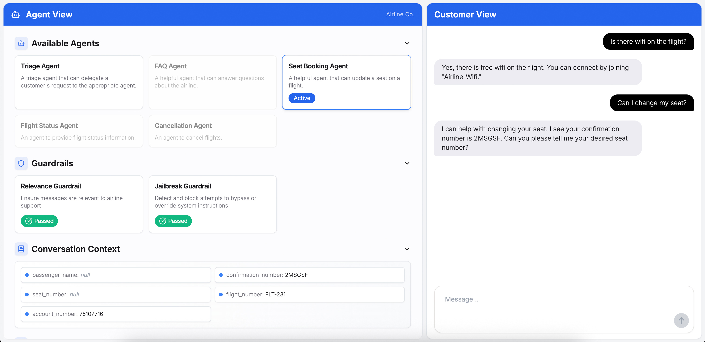

# ERNI Gruppe Building Agents 🏗️

[](https://github.com/DIZ-admin/openai-cs-agents)
[](https://github.com/DIZ-admin/openai-cs-agents/releases)
[](LICENSE)
[](https://www.python.org/)
[](https://nextjs.org/)
[](https://openai.github.io/openai-agents-python/)
[](https://fastapi.tiangolo.com/)

> **AI-powered customer service system for timber construction projects**

An intelligent multi-agent system built for **ERNI Gruppe**, a leading Swiss timber construction company. This system provides automated customer support for building projects, cost estimation, project status tracking, and consultation scheduling.



---

## 🌟 Features

### 🤖 6 Specialized AI Agents
- **Triage Agent** - Intelligent routing to appropriate specialists
- **Project Information Agent** - General building and construction information
- **Cost Estimation Agent** - Preliminary project cost calculations
- **Project Status Agent** - Real-time project tracking and updates
- **Appointment Booking Agent** - Consultation scheduling with specialists
- **FAQ Agent** - Answers to common building questions

### 🛡️ Safety & Security
- **Input Guardrails** - Relevance and jailbreak protection
- **Rate Limiting** - API protection and abuse prevention
- **Input Validation** - Pydantic-based data validation
- **Security Headers** - CSP, HSTS, X-Frame-Options

### 🚀 Production-Ready
- **Health Checks** - `/health` and `/readiness` endpoints
- **Docker Support** - Multi-stage builds for backend and frontend
- **CI/CD Pipeline** - Automated testing and deployment
- **Monitoring** - Sentry integration, Prometheus metrics
- **Documentation** - Comprehensive deployment and API docs

### 🌍 Bilingual Support
- German and English language support
- Automatic language detection
- Context-aware responses

---

## 📚 Documentation

| Document | Description |
|----------|-------------|
| **[AGENTS.md](AGENTS.md)** | Complete technical documentation of the multi-agent system |
| **[DEPLOYMENT.md](DEPLOYMENT.md)** | Production deployment guide with SSL, monitoring, security |
| **[STAGING_DEPLOYMENT.md](python-backend/STAGING_DEPLOYMENT.md)** | **NEW:** Staging deployment guide and testing procedures |
| **[CHANGELOG.md](python-backend/CHANGELOG.md)** | **NEW:** Version history and release notes |
| **[PRODUCTION_CHECKLIST.md](PRODUCTION_CHECKLIST.md)** | Pre-deployment and post-deployment checklist |
| **[ERNI_ADAPTATION.md](ERNI_ADAPTATION.md)** | Business context and adaptation overview |

---

## 🚀 Quick Start

### Prerequisites

- **Python 3.10+** (recommended 3.11 or 3.12)
- **Node.js 18+** (LTS recommended)
- **OpenAI API Key** ([Get one here](https://platform.openai.com/api-keys))

### 1. Clone the Repository

```bash
git clone https://github.com/DIZ-admin/openai-cs-agents.git
cd openai-cs-agents
```

### 2. Set Up Environment Variables

Create a `.env` file in the `python-backend` directory:

```bash
cd python-backend
cp .env.example .env
```

Edit `.env` and add your OpenAI API key:

```env
OPENAI_API_KEY=sk-proj-your-api-key-here
ENVIRONMENT=development
DEBUG=true
```

### 3. Install Dependencies

**Backend:**
```bash
cd python-backend
python -m venv .venv
source .venv/bin/activate  # On Windows: .venv\Scripts\activate
pip install -r requirements.txt
```

**Frontend:**
```bash
cd ui
npm install
```

### 4. Run the Application

**Option A: Run Both Services Simultaneously**
```bash
cd ui
npm run dev
```
- Frontend: http://localhost:3000
- Backend: http://127.0.0.1:8000

**Option B: Run Services Separately**

Backend:
```bash
cd python-backend
source .venv/bin/activate
uvicorn api:app --reload --port 8000
```

Frontend:
```bash
cd ui
npm run dev:next
```

### 5. Test the Application

Open http://localhost:3000 and try:
- "Hello, I want to build a wooden house"
- "How much would a 150m² house cost?"
- "I'd like to book a consultation"

---

## 🐳 Docker Deployment

### Quick Start with Docker Compose

```bash
# Copy environment file
cp python-backend/.env.example python-backend/.env

# Edit .env and add your OPENAI_API_KEY

# Start all services
docker-compose up -d
```

Services will be available at:
- **Frontend:** http://localhost:3000
- **Backend API:** http://localhost:8000
- **Health Check:** http://localhost:8000/health

### Production Deployment

See **[DEPLOYMENT.md](DEPLOYMENT.md)** for comprehensive production deployment instructions including:
- SSL/HTTPS setup
- Database configuration
- Monitoring and logging
- Security best practices
- Cloud deployment options

---

## 💬 Demo Flows

### Flow 1: Cost Estimation & Consultation Booking

1. **Initial Inquiry:**
   ```
   User: "Hello, I want to build a wooden house"
   Triage Agent → Project Information Agent
   ```

2. **Cost Estimation:**
   ```
   User: "How much would a 150m² house cost?"
   Project Information Agent → Cost Estimation Agent

   Cost Estimation Agent asks:
   - Project type? (Einfamilienhaus/Mehrfamilienhaus/Agrar)
   - Construction type? (Holzbau/Systembau)

   User: "Single-family house with timber frame construction"

   Agent: "📊 Preliminary Cost Estimate:
   - Type: Einfamilienhaus (150 m²)
   - Construction: Holzbau
   - Estimated cost: CHF 450,000 - 562,500
   - Price per m²: CHF 3,000"
   ```

3. **Book Consultation:**
   ```
   User: "I'd like to book a consultation"
   Cost Estimation Agent → Appointment Booking Agent

   Agent: "Which specialist do you need?
   - Architekt (Architect)
   - Holzbau-Ingenieur (Timber Engineer)
   - Bauleiter (Construction Manager)"

   User: "Architect please, next Tuesday at 14:00"

   Agent: "✅ Consultation Booked!
   - Specialist: Architekt (André Arnold)
   - Date: Tuesday, 14:00
   - Location: ERNI Gruppe, Guggibadstrasse 8, 6288 Schongau"
   ```

### Flow 2: Project Status & FAQ

1. **Project Status Check:**
   ```
   User: "What's the status of project 2024-156?"
   Triage Agent → Project Status Agent

   Agent: "📊 Project Status #2024-156
   - Type: Einfamilienhaus
   - Location: Muri
   - Current stage: Production (75% complete)
   - Next milestone: Assembly 15-19 May 2025
   - Project manager: Tobias Wili"
   ```

2. **FAQ Question:**
   ```
   User: "Why should I choose wood for my house?"
   Project Status Agent → FAQ Agent

   Agent: "🌲 Why Wood?
   ✓ Ecological and renewable
   ✓ Excellent thermal insulation
   ✓ Healthy indoor climate
   ✓ CO2-neutral
   ✓ Fast assembly

   ERNI is a certified Minergie partner."
   ```

3. **Guardrail Protection:**
   ```
   User: "Write a poem about strawberries"

   ⚠️ Relevance Guardrail triggered
   Agent: "Sorry, I can only answer questions related to building and construction."
   ```

---

## 🏗️ Architecture

### Multi-Agent System

```
┌─────────────────┐
│  Triage Agent   │ ← Entry point, intelligent routing
└────────┬────────┘
         │
    ┌────┴────┬────────┬────────┬────────┐
    │         │        │        │        │
┌───▼───┐ ┌──▼──┐ ┌───▼───┐ ┌──▼──┐ ┌──▼──┐
│Project│ │Cost │ │Project│ │Appt │ │ FAQ │
│ Info  │ │Est. │ │Status │ │Book │ │Agent│
└───────┘ └─────┘ └───────┘ └─────┘ └─────┘
```

### Technology Stack

**Backend:**
- Python 3.11+ with FastAPI
- OpenAI Agents SDK 0.3.3
- Pydantic for data validation
- Uvicorn/Gunicorn ASGI server

**Frontend:**
- Next.js 15.5.4 with App Router
- React 19
- TypeScript 5.x
- Tailwind CSS

**Infrastructure:**
- Docker & Docker Compose
- Nginx reverse proxy
- PostgreSQL 14+ (production)
- Redis 7.x (caching & rate limiting)

---

## 🧪 Testing

### Run All Tests

```bash
cd python-backend
source .venv/bin/activate
python -m pytest tests/ -v
```

**Test Coverage:**
- ✅ **228 tests** (100% passing)
- ✅ **90.04% code coverage** (exceeds 80% requirement)
- ✅ Unit tests for all agents, tools, and guardrails
- ✅ Integration tests for API endpoints
- ✅ Mock data for offline testing

### Test Categories

**Unit Tests:**
- Agent behavior and instructions
- Tool functionality (cost estimation, booking, FAQ)
- Guardrails (relevance, jailbreak protection)
- Context management

**Integration Tests:**
- API endpoints (`/health`, `/readiness`, `/chat`, `/agents`)
- Agent handoffs and state management
- Error handling and rate limiting

### Run Specific Tests

```bash
# Unit tests only
pytest tests/unit/ -v

# Integration tests only
pytest tests/integration/ -v

# With coverage report
pytest tests/ --cov=. --cov-report=html
# Open htmlcov/index.html in browser
```

---

## 🚀 Staging Deployment

### Quick Staging Setup

```bash
# 1. Navigate to backend
cd python-backend

# 2. Copy staging environment
cp .env.staging .env

# 3. Configure required variables
# - OPENAI_API_KEY (your staging key)
# - CORS_ORIGINS (your staging domain)
# - SECRET_KEY (generate with: openssl rand -hex 32)

# 4. Install dependencies
pip install -r requirements.txt

# 5. Run tests
python -m pytest tests/ -v

# 6. Start server
uvicorn api:app --host 0.0.0.0 --port 8000 --env-file .env
```

**For detailed staging deployment instructions, see [STAGING_DEPLOYMENT.md](python-backend/STAGING_DEPLOYMENT.md)**

---

## 🔧 Customization

This system is designed for ERNI Gruppe but can be adapted for other use cases:

1. **Modify Agents** - Update agent instructions in `python-backend/main.py`
2. **Add Tools** - Create new tools for specific business logic
3. **Update Context** - Modify `BuildingProjectContext` for your data model
4. **Customize UI** - Update branding in `ui/components/`
5. **Add Guardrails** - Implement custom input validation

See **[AGENTS.md](AGENTS.md)** for detailed customization guide.

---

## 📊 API Endpoints

### Health Checks

- **`GET /health`** - Basic liveness check
  ```json
  {
    "status": "healthy",
    "timestamp": "2025-10-04T09:45:41.219950",
    "version": "1.0.0",
    "environment": "production"
  }
  ```

- **`GET /readiness`** - Comprehensive dependency check
  ```json
  {
    "status": "ready",
    "checks": {
      "openai_api": true,
      "environment_configured": true
    }
  }
  ```

### Chat API

- **`POST /chat`** - Send message to agents
  ```json
  {
    "message": "I want to build a house",
    "conversation_id": "optional-uuid"
  }
  ```

---

## 🧪 Testing

### Run Backend Tests
```bash
cd python-backend
source .venv/bin/activate
pytest tests/ -v
```

### Run Frontend Tests
```bash
cd ui
npm test
npm run test:e2e
```

### Health Check Tests
```bash
# Test health endpoint
curl http://localhost:8000/health

# Test readiness endpoint
curl http://localhost:8000/readiness
```

---

## 📈 Monitoring & Logging

### Application Monitoring
- **Sentry** - Error tracking and performance monitoring
- **Prometheus** - Metrics collection
- **Grafana** - Metrics visualization

### Logging
- Structured JSON logging
- Log levels: DEBUG, INFO, WARNING, ERROR, CRITICAL
- Log aggregation with ELK Stack (optional)

See **[DEPLOYMENT.md](DEPLOYMENT.md)** for monitoring setup instructions.

---

## 🔒 Security

### Implemented Security Measures
- ✅ Input validation with Pydantic
- ✅ Rate limiting (60 req/min for API)
- ✅ CORS policy configuration
- ✅ Security headers (CSP, HSTS, X-Frame-Options)
- ✅ Environment variable validation
- ✅ Secrets management best practices
- ✅ Input guardrails (relevance & jailbreak protection)

### Security Best Practices
- Never commit API keys to version control
- Use environment-specific API keys
- Rotate keys every 90 days
- Enable HTTPS in production
- Regular security audits

---

## 🤝 Contributing

We welcome contributions! Please follow these steps:

1. Fork the repository
2. Create a feature branch (`git checkout -b feature/amazing-feature`)
3. Commit your changes (`git commit -m 'Add amazing feature'`)
4. Push to the branch (`git push origin feature/amazing-feature`)
5. Open a Pull Request

### Development Guidelines
- Follow PEP 8 for Python code
- Use TypeScript for frontend code
- Write tests for new features
- Update documentation
- Run linters before committing

### Testing

The project includes a comprehensive test suite with **80%+ code coverage**.

#### Running Tests

```bash
# Install test dependencies
cd python-backend
pip install pytest pytest-asyncio pytest-mock pytest-cov faker

# Run all tests
pytest tests/ -v

# Run with coverage
pytest tests/ -v --cov=. --cov-report=html --cov-report=term-missing

# Run specific test categories
pytest tests/unit/ -v                    # Unit tests only
pytest tests/integration/ -v             # Integration tests only
pytest tests/unit/tools/ -v              # Tool tests only

# Run tests in parallel (faster)
pytest tests/ -n auto -v
```

#### Test Coverage

Comprehensive tests for:
- **Guardrails**: Input validation and security checks
- **Tools**: All 5 agent tools (FAQ lookup, cost estimation, specialist availability, consultation booking, project status)
- **Agents**: All 6 specialized agents (Triage, Project Information, Cost Estimation, Project Status, Appointment Booking, FAQ)
- **API Endpoints**: Health checks, readiness checks, and chat API
- **Integration**: End-to-end API testing with mocked dependencies

#### Continuous Integration

Tests run automatically via GitHub Actions on:
- Push to `main`, `production`, `develop` branches
- Pull requests to `main`, `production`
- Multiple Python versions (3.10, 3.11, 3.12)
- Security scanning with bandit and safety
- Docker build testing

See `.github/workflows/test.yml` for the complete CI/CD pipeline.

---

## 📝 License

This project is licensed under the MIT License. See the [LICENSE](LICENSE) file for details.

---

## 🙏 Acknowledgments

- **OpenAI** - For the Agents SDK and GPT models
- **ERNI Gruppe** - For the business requirements and domain expertise
- **FastAPI** - For the excellent Python web framework
- **Next.js** - For the powerful React framework

---

## 📞 Support

For questions, issues, or feature requests:

- **GitHub Issues:** [Create an issue](https://github.com/DIZ-admin/openai-cs-agents/issues)
- **Documentation:** [AGENTS.md](AGENTS.md), [DEPLOYMENT.md](DEPLOYMENT.md)
- **Email:** support@example.com (replace with actual support email)

---

## 🗺️ Roadmap

### Version 1.1 (Planned)
- [ ] Database integration (PostgreSQL)
- [ ] User authentication and authorization
- [ ] Multi-language support (French, Italian)
- [ ] Advanced analytics dashboard
- [ ] Email notifications for consultations

### Version 2.0 (Future)
- [ ] Mobile app (React Native)
- [ ] Voice interface integration
- [ ] Document upload and analysis
- [ ] 3D building visualization
- [ ] Integration with ERNI's ERP system

---

**Built with ❤️ for ERNI Gruppe** | **Powered by OpenAI Agents SDK**
